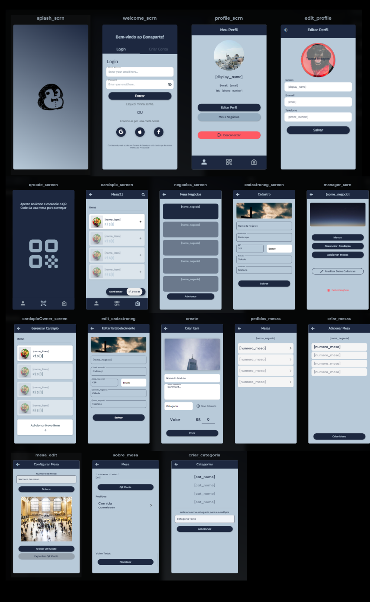

# Documentação Bonaparte:

### **Ideia Central**
> **App Flutter capaz de recohecer códigos QR presenes nas mesas de restaurantes para agilizar solicitação e gerenciamento de pedidos.**

### **Tecnologias:**
> - **Dart - 2.17**
> - **Flutter - 3.0**
> - **qr_code_scanner** - 1.0
> - **Firebase**

### **Configurações:**
> - **[Intalação do Flutter SDK](https://docs.flutter.dev/get-started/install)**
> - **[Instalação Android Studio + Emulador](https://developer.android.com/studio)**
> - **[Configuração do Android Emulador](https://radixweb.com/blog/install-flutter-on-windows-mac-and-android)**
> - **[Solicitar Acessos do Firebase aos membros da Equipe](https://console.firebase.google.com/u/0/?hl=pt-br&pli=1)**

### **Uso do APP:**

Telas presentes no APP:

O app se inicia em splash_scrn e após o loading vai para welcome_scrn, em welcome_scrn é possível fazer login e cadastro. Após fazer o cadastroo usuario é redirecionado para profile_scrn onde pode conferir seus dados e aatualiza-los, além de poder mudar para as outras duas telas utilizando os botões no canto inferior da tela. O primeiro botão leva para a câmera qrcode_scrn. No segundo botão o usuario é redirecionado para os negocios (caso possua) negocios_scrn. Na tela de negocios é possível criar novos negócios cadastroneg_scrn e gerenciar os negócios criados manager_scrn e editar os negócios cadastrados edit_cadastroneg. dentro de cada negocios é possivel visualizar os cardapios cardapioOwner_screen visualizar e criar as mesas 

### **Arquitetura do Banco NoSQL:**

